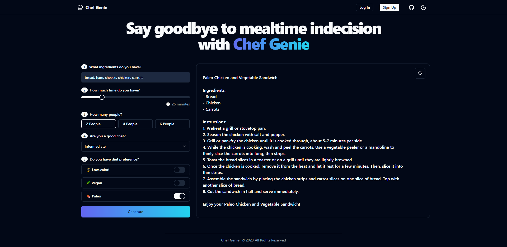

# Chef Genie

Customizable recipe generator powered by OpenAI and ChatGPT.



## Features

- **Framework**: [Next.js](https://nextjs.org/)
- **Deployment**: [Vercel](https://vercel.com)
- **Styling**: [Tailwind CSS](https://tailwindcss.com)
- **Primitives**: [Radix UI](https://https://www.radix-ui.com)
- **Icons**: [Lucide](https://lucide.dev)
- **Fonts**: `@next/font`
- **Dark mode**: `next-themes`
- **Analytics**: [Vercel Analytics](https://vercel.com/analytics)
- Automatic import sorting with `@ianvs/prettier-plugin-sort-imports`
- Tailwind CSS class sorting, merging and linting.

## Credits

A huge thanks for inspiration, code snippets and ideas to:

- Lee Robinson [@leeerob](https://twitter.com/leeerob)
- Shadcn [@shadcn](https://twitter.com/shadcn)

## Running Locally

```bash
git clone https://github.com/giacomogaglione/wine-match.git
cd wine-match
pnpm install
pnpm dev
```

Create `.env` file.

## License

Licensed under the [MIT license](https://github.com/giacomogaglione/chef-gpt/blob/main/LICENSE.md).
